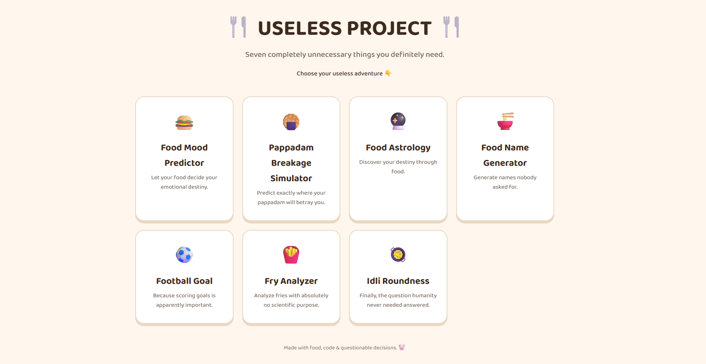
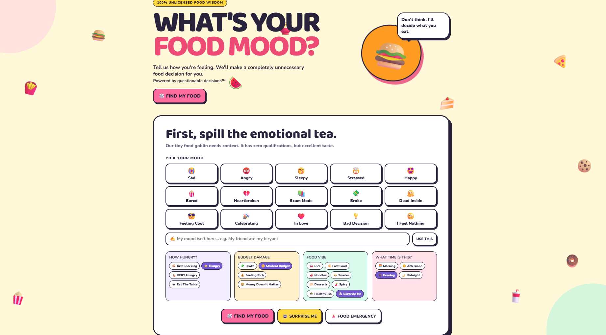
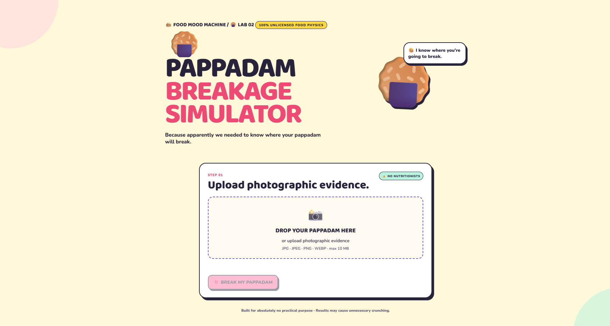
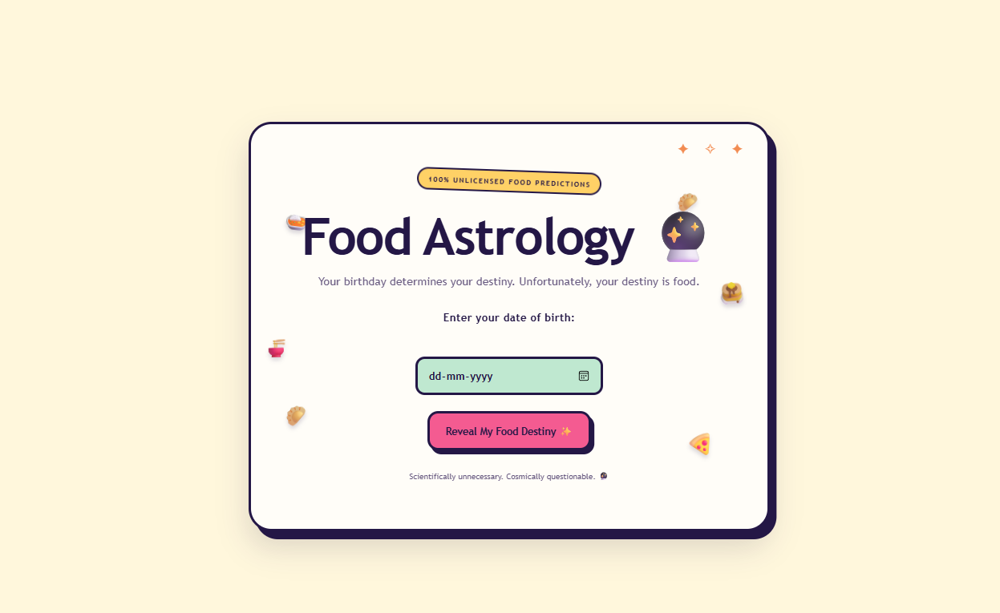
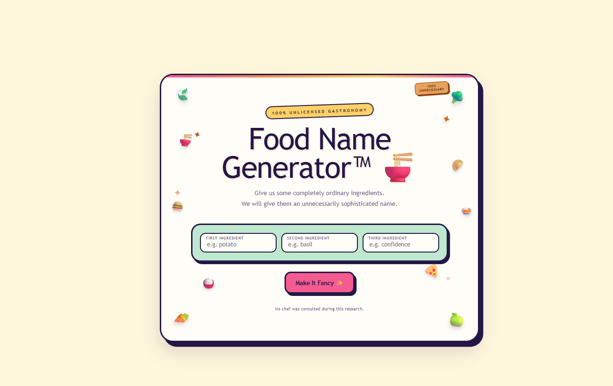
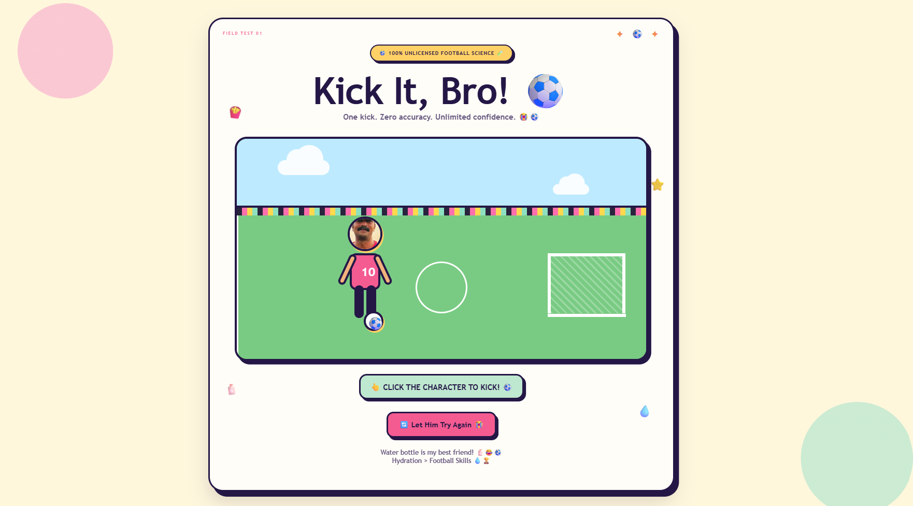
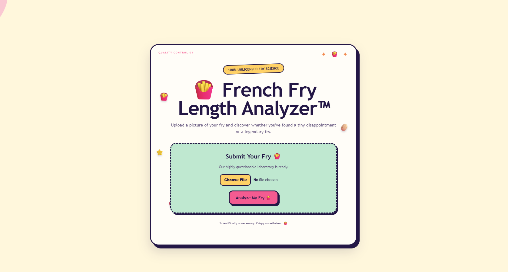
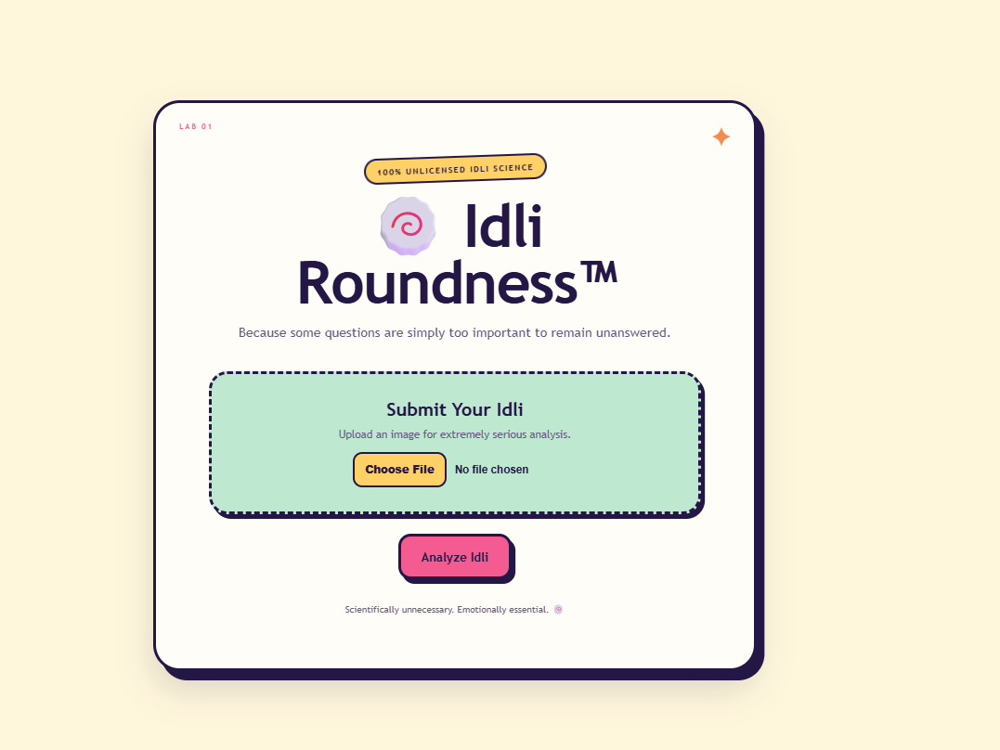

# FOOD LAB 🎯

## Basic Details
### Team Name: BITSPARK

### Team Members
- Team Lead: FARIDAH ZAFRIN ANSARI - TKMCE
- Member 2: ALAKANANDA D - TKMCE

### Project Description

FOOD LAB is a fun collection of completely unnecessary food-themed web applications. It brings together seven quirky and entertaining features into a single website, each designed to solve a problem that nobody actually has.

The project combines creativity, humor, and simple web technologies to create an interactive experience where users can explore absurd food-related ideas and have fun with them.

### The Problem (that doesn't exist)
Humanity has many serious problems, so we decided to focus on the ones that absolutely do not exist.

Our project answers extremely important questions such as:

- What food matches my current mood?
- Where will my pappadam break?
- How round is my idli?
- What does food astrology say about my future?
- What ridiculous name should my food have?
- Can we score a completely unnecessary football goal?
- How scientifically can we analyze a fry?

The goal is not to solve real-world problems, but to create a fun and entertaining website using simple web technologies.

### The Solution (that nobody asked for)
### 1. Food Mood Predictor 🍛

Predicts a food recommendation based on the user's current mood.

### 2. Pappadam Breakage Simulator 🫓

Predicts where a pappadam is likely to break when an image is uploaded.

### 3. Food Astrology 🔮

Provides fun and completely questionable food-based predictions about the user's future.

### 4. Food Name Generator 🍔

Generates funny and creative names for food.

### 5. Football Goal Game ⚽

A fun football-themed interactive game involving goal scoring.

### 6. Fry Analyzer 🍟

Analyzes fries for absolutely no serious scientific purpose.

### 7. Idli Roundness Analyzer 🍥

Analyzes an idli and determines how round it is.

## Technical Details
### Technologies/Components Used
For Software:

- HTML
- CSS
- JavaScript
- Git
- GitHub
- GitHub Pages

### Implementation
For Software:The project was implemented as a collection of independent web-based features using HTML, CSS, and JavaScript.

The homepage (`index.html`) acts as the main navigation hub and provides links to all seven features.

Each feature was developed as an individual webpage with its own interface and JavaScript functionality. The Pappadam Breakage Simulator is organized separately inside the `pappadam-simulator` folder with its own HTML, CSS, and JavaScript files.

The main implementation areas include:

- **User Interface:** HTML and CSS were used to create the pages, layouts, buttons, forms, and visual elements.
- **Interactivity:** JavaScript was used to process user inputs and generate results.
- **Image-based Features:** Image upload and analysis functionality was implemented for features such as the Pappadam Breakage Simulator and Idli Roundness Analyzer.
- **Navigation:** The homepage connects all seven features through individual links.
- **Version Control:** Git and GitHub were used for branch-based development, collaboration, merging, and deployment.
- **Deployment:** The completed project was deployed using GitHub Pages.
# Installation
No additional software or external dependencies are required to run the project.

# Run
python3 -m http.server 8000

### Project Documentation
For Software:- README.md — Project overview, installation, implementation, features, testing, and deployment details.
- Architecture Diagram — Available in `docs/architecture.png`.
- Screenshots — Available in `docs/screenshots/`.
- Demo Video — Demonstrates the working features of the project.

# Screenshots (Add at least 3)
## Screenshots

### Homepage

### Food Mood Predictor

### Pappadam Breakage Simulator

### Food Astrology

### Food Name Generator

### Football Goal

### Fry Analyzer

### Idli Roundness Analyzer

# Diagrams

*The architecture diagram shows the structure of the project, including the unified homepage and the individual food-themed features.*
### Project Demo
# Video
https://drive.google.com/file/d/1HaGFPQYym0WxQUhQCNUx5-5yT-XLTwBe/view?usp=sharing
The video demonstrates the complete USELESS PROJECT website, including the homepage and all seven interactive food-themed features. It shows how users navigate through the website and interact with each feature, including the Food Mood Predictor, Pappadam Breakage Simulator, Food Astrology, Food Name Generator, Football Goal Game, Fry Analyzer, and Idli Roundness Analyzer.
## Team Contributions
- ## Team Contributions

- **Alakananda:** Developed the Food Mood Predictor and Pappadam Breakage Simulator. Worked on integrating the features into the unified website, documentation, testing, and deployment.

- **Faridah Zafrin:** Developed the Food Astrology, Food Name Generator, Football Goal, Fry Analyzer, and Idli Roundness features.

---
Made with ❤️ at TinkerHub Useless Projects 

